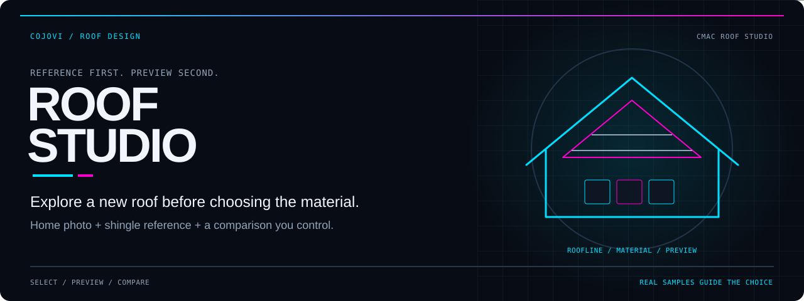
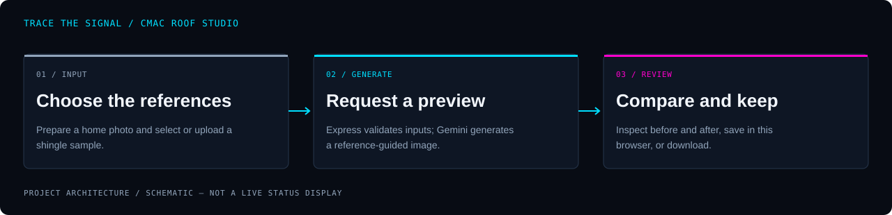

<!-- COJOVI / SIGNAL — CMAC Roof Studio project edition. Commit with readme-assets/. -->
<a name="top"></a>

<p align="center">
  
</p>

<h1 align="center">CMAC Roof Studio</h1>

<p align="center">
  <strong>Choose a material. Preview your roof. Compare before you commit.</strong><br>
  A reference-guided roofing visualizer with a curated shingle library and device-local saved designs.
</p>

<p align="center">
  
</p>

<p align="center">
  <a href="#overview">Overview</a> ·
  <a href="#architecture">Architecture</a> ·
  <a href="#quickstart">Quickstart</a> ·
  <a href="#configuration">Configuration</a> ·
  <a href="#usage">Usage</a> ·
  <a href="#security">Security</a>
</p>

---

<a name="overview"></a>
## `> meet_roof_studio`

**CMAC Roof Studio turns a home photo and a shingle reference into an AI-assisted roof preview.** Upload a photograph, use the camera, or try the bundled sample home; then choose a manufacturer, product line, and color before generating.

The repository is named **cmac_shingle_visualizer**; its package identifier remains `cmac-roofing-visualizer`. The interface and this guide use **CMAC Roof Studio**.

| Select | Visualize | Compare |
| :--- | :--- | :--- |
| Search a curated catalog or supply your own material reference. | Send a home photo and reference together to a server-side image model. | Use the before/after slider, save on this device, or download the preview. |

The [catalog](data/catalog.json) contains **8 collections and 67 product/color combinations from 6 manufacturers**. It is a curated library, not a live supplier inventory. GAF entries require an uploaded reference; other listed combinations have bundled swatches.

> [!IMPORTANT]
> **A visualization is not a color guarantee or construction specification.** Roof-only editing is a model instruction, not a deterministic mask. Check real samples, local availability, and the complete result before making a purchasing decision.

<a name="architecture"></a>
## `> trace_the_preview`

<p align="center">
  
</p>

```text
Browser: photo + catalog selection / custom sample
    → Express: validate request + resolve material reference
    → Gemini: generate an image from both references
    → Browser: compare → save to IndexedDB / download
```

The [browser service](services/geminiService.ts) calls `POST /api/generate`; it does not hold the provider key. The [Node server](server/index.ts) serves Vite in development and the built frontend in production. `GET /api/health` reports whether a key is present—not whether billing or model access works.

The [generation module](server/generate.ts) validates catalog selections and image payloads, then loads a bundled swatch or uses the uploaded reference. It does not silently substitute another product when a swatch is missing.

<a name="quickstart"></a>
## `> open_the_studio`

**Prerequisites:** Git, Node.js 22 or newer, npm, and a modern browser. Generation additionally needs a Gemini API account with billing and access to the configured image model.

### 1. Install the source

```bash
git clone --branch main https://github.com/cojovi/cmac_shingle_visualizer.git
cd cmac_shingle_visualizer
npm ci
cp .env.example .env.local
```

### 2. Configure and start

Edit `.env.local` and set `GEMINI_API_KEY` on the server. Leave it empty to explore the catalog and sample-home workflow without generating images.

```bash
npm run dev
```

Open **[http://localhost:3000](http://localhost:3000)**. Restart the server after changing environment configuration.

> [!WARNING]
> **Never put the API key in a `VITE_` variable or browser source.** Keep `.env.local` private. The included server has no application login; protect it before exposing a paid generation endpoint to other people.

### 3. Build for hosting

```bash
npm run build
npm start
```

Run from the repository root. Keep the installed dependencies, `server/`, `data/`, `types.ts`, `public/`, and generated `dist/` with the application. **Uploading only `dist/` to a static host does not provide generation.** The start command executes TypeScript through `tsx`, which is currently a development dependency; do not prune it from a source-based deployment.

<a name="configuration"></a>
## `> tune_the_studio`

The server loads [`.env.example`](.env.example)'s settings from `.env.local`, then `.env`; existing process environment values take precedence. These are server-side settings, not client-side Vite configuration.

| Variable | Purpose |
| :--- | :--- |
| `GEMINI_API_KEY` | Provider credential; required for generation only. |
| `GEMINI_IMAGE_MODEL` | Image model identifier; defaults to `gemini-3.1-flash-image`. |
| `PORT` | HTTP port; defaults to `3000`. |
| `HOST` | Listening interface; defaults to loopback, `127.0.0.1`. |

The default model is a source configuration value, **not a promise of account access or current provider availability**. Confirm access in your own account before enabling generation.

The [server](server/index.ts) limits generation to two simultaneous requests per process and ten counted attempts per IP in a fifteen-minute window when a key is configured. These in-memory controls are not distributed quotas, authentication, or a spending cap.

<a name="usage"></a>
## `> design_a_roof`

1. **Add the home.** Upload JPG, PNG, or WebP; use **Camera** with browser permission; or choose **Try this home**.
2. **Choose the material.** Search by manufacturer, collection, or color, or open the shingle library.
3. **Supply a reference when needed.** For a custom shingle, enter manufacturer, product line/style, and color name, then upload its sample. Missing catalog swatches also require an upload.
4. **Generate deliberately.** Choose **Visualize my roof** to send the prepared images to the configured provider. A paid request may be incurred.
5. **Inspect and keep.** Compare original and preview, save the design on this device, or download the generated image. A changed selection needs a new preview.

[Photo preparation](utils/fileUtils.ts) accepts files up to 12 MB and images at least 200 × 200 pixels, resizes the longest side to at most 2,048 pixels, and re-encodes as JPEG. Export HEIC photos to a supported format first. Camera capture needs a secure browser context, such as HTTPS or localhost.

[Saved designs](utils/storage.ts) use IndexedDB in the current browser and origin. There is no account sync or server-side design archive. Clearing browser storage removes saved designs; download anything you need to retain. Unsaved recent previews are session-only and capped at eight.

<a name="validation"></a>
## `> check_the_work`

For a complete checkout with dependencies installed:

```bash
npm test
npm run build
# Install the browser only if it is not already available.
npx playwright install chromium
npm run test:e2e
```

- [Backend tests](tests/generation.test.ts) cover catalog references, prompt grounding, custom materials, and invalid image payloads.
- [Browser tests](tests/studio.spec.ts) cover layout, selection, comparison, saving, downloads, cancellation, and error handling. Generation responses are mocked; they do not establish live image-model quality.
- The build script runs TypeScript checking before Vite. Playwright uses the local server defined in [its configuration](playwright.config.ts).

**Builds and tests were not run for this documentation-only task; no live provider calls were made.**

### Before sharing the studio

- [ ] Confirm model access, billing, and provider data-handling terms.
- [ ] Add authentication and HTTPS before remote access.
- [ ] Review proxy/IP handling and add deployment-level quotas where needed.
- [ ] Verify catalog references against current manufacturer information.
- [ ] Test camera permissions, storage availability, and downloads on target devices.
- [ ] Check every generated preview against the original home and physical material samples.

<a name="source"></a>
## `> explore_the_source`

| Source | Responsibility |
| :--- | :--- |
| [App.tsx](App.tsx) | Studio state, upload flow, generation, recent previews, and saved-design restoration. |
| [components/](components/) | Catalog, camera, comparison slider, and dialogs. |
| [server/](server/) | Serving, input validation, provider integration, and request limits. |
| [data/catalog.json](data/catalog.json) | Product/color records and manufacturer reference URLs. |
| [utils/](utils/) | Browser photo preparation, downloads, and IndexedDB storage. |
| [Product research](docs/PRODUCT_RESEARCH.md) | Catalog scope, source notes, and reference-fidelity limitations. |

<a name="security"></a>
## `> keep_photos_private`

**Generation sends the prepared home image and material reference to Google's Gemini service.** Use only photos you are permitted to process. Re-encoding removes embedded image metadata, but does not remove visible addresses, people, or other sensitive content from the picture.

The application does not persist submitted photos on the server or log request bodies in its generation handler. Provider processing, infrastructure logging, and device-local saved designs have separate privacy implications. Review your deployment and provider terms rather than treating this as an offline tool.

The origin check is not authentication. Keep the loopback default for local use; put an authenticated gateway and appropriate network controls in front of a shared deployment. Cancellation aborts the local operation, but a request already accepted by the provider may still incur usage.

### Attribution and license

This is the **[cojovi/cmac_shingle_visualizer](https://github.com/cojovi/cmac_shingle_visualizer)** project, presented in COJOVI / SIGNAL. No repository license file was found in the audited revision; public source availability does not establish unrestricted reuse rights.

Manufacturer names, trademarks, and source imagery remain the property of their respective owners. Retain the [image attribution](public/images/ATTRIBUTION.md) and [product research notes](docs/PRODUCT_RESEARCH.md). README artwork is schematic documentation artwork, not a manufacturer sample or generated roofing result.

---

<p align="center">
  
</p>

<p align="center">
  <strong>Reference the material. Inspect the result. Keep the choice yours.</strong><br>
  <sub>A <a href="https://github.com/cojovi">Cody / cojovi</a> project · <a href="https://cojovi.com">cojovi.com</a><br>
  CMAC Roof Studio · Presented in COJOVI / SIGNAL.</sub>
</p>

<p align="center"><a href="#top">↑ Back to the signal</a></p>
